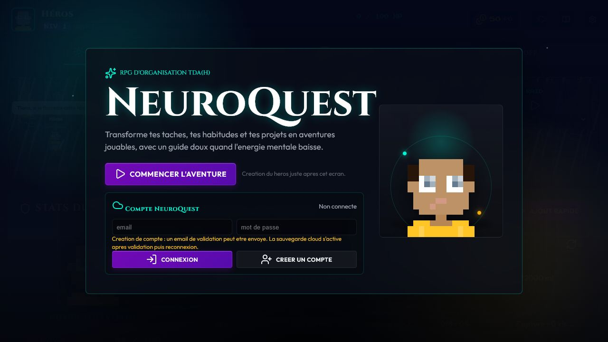
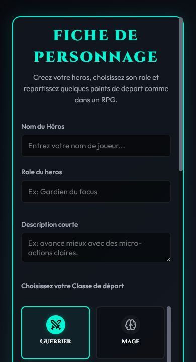
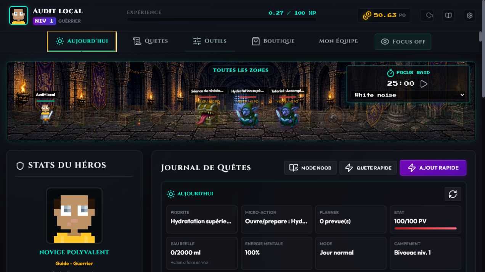
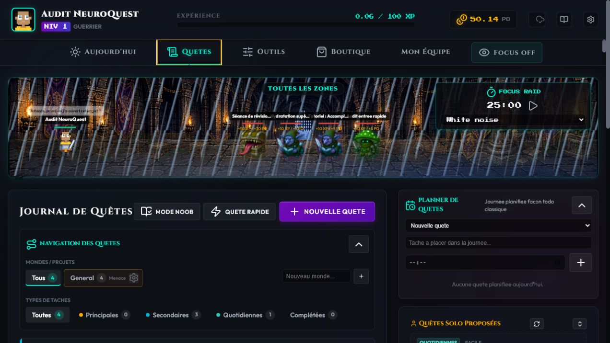
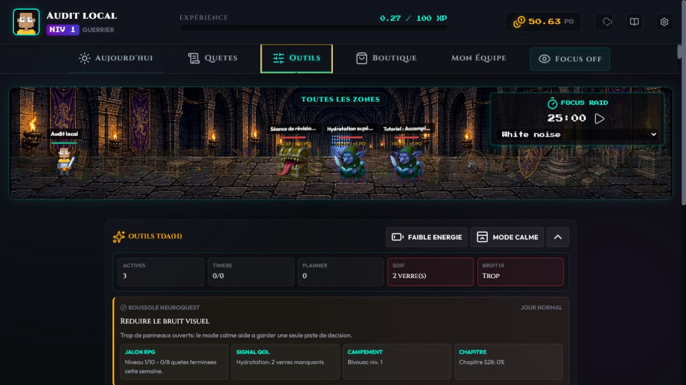
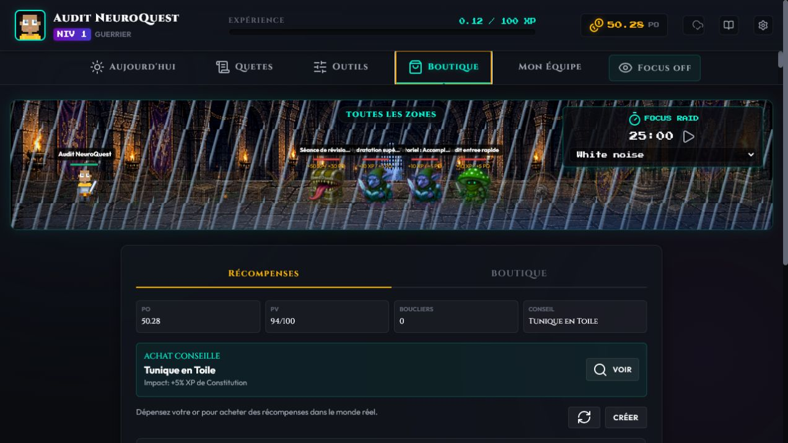
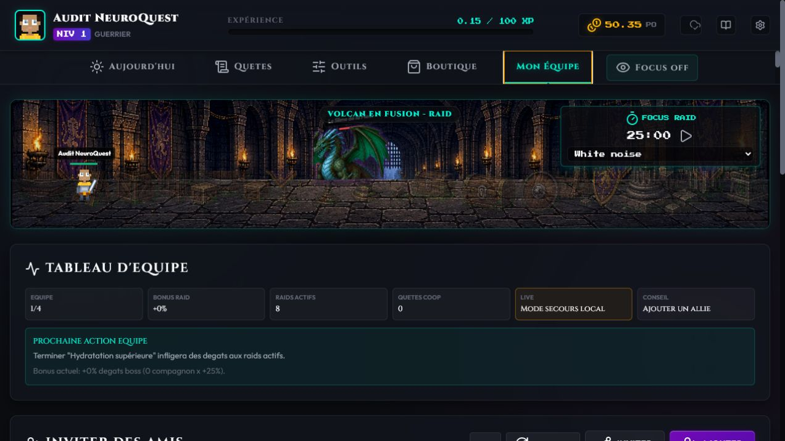
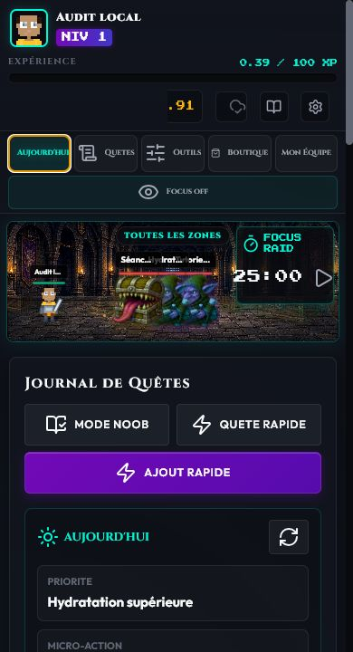

# Audit de coherence NeuroQuest - 10 juillet 2026

## Perimetre

Audit combine UX, responsive, accessibilite visible et fonctionnement des parcours principaux : accueil, creation du heros, Aujourd'hui, Quetes, Outils, Boutique, Mon Equipe, ajout rapide, planner, Focus/bruit et sauvegarde locale.

## Verdict

Le concept est coherent : une vraie tache devient une quete, le monstre montre la pression, le planner transforme l'heure en approche, et les modes Focus/calme/faible energie reduisent la friction TDA(H). Le principal risque etait devenu la densite de l'interface, surtout sur Aujourd'hui et mobile. La passe a corrige les incoherences certaines sans retirer de fonctionnalite.

## Parcours audite

1. **Accueil - bon.** Le nom NeuroQuest, la promesse TDA(H), l'action principale et le compte sont compris rapidement.

   

2. **Creation du heros - bon apres correction.** Les cinq points sont maintenant annonces en continu et le bouton final reste desactive tant qu'ils ne sont pas repartis.

   

3. **Aujourd'hui desktop - bon.** La battle scene reste visible, puis la priorite et le bilan occupent la zone principale. Un seul bouton Faible energie est visible.

   

4. **Quetes - bon mais dense.** La separation journal / planner / propositions est logique et les tiroirs permettent d'alleger. Le planner accepte les quetes existantes.

   

5. **Outils - bon apres correction.** Le panneau TDA(H), le mode calme, la recuperation, la boussole et le bruit sont regroupes ici. Le panneau ne repart plus dans Aujourd'hui pendant un rendu.

   

6. **Boutique - bon.** PO, PV, conseil d'achat, recompenses reelles et equipement forment un parcours unique. Les actions reelles restent distinguees des objets RPG.

   

7. **Mon Equipe - bon en mode local.** L'etat de l'equipe, la prochaine action, l'invitation et les raids sont ordonnes. La synchro live demande encore un test authentifie a deux comptes.

   

8. **Mobile - bon apres correction.** Les cinq onglets ne se chevauchent plus, Focus garde sa ligne, Aujourd'hui passe avant la fiche du heros, les tooltips tactiles ne couvrent plus l'ecran et la page conserve un scroll vertical sans debordement horizontal.

   

## Corrections realisees

- Navigation mobile en deux lignes avec Focus toujours visible.
- Suppression des chevauchements de navigation et des tooltips persistants au toucher.
- Battle scene mobile allegee : gains statiques masques, noms tronques proprement, controle Focus compacte.
- Journal Aujourd'hui place avant la fiche du heros sur mobile.
- Entete des quetes mobile reorganisee en commandes tactiles stables.
- Outils TDA(H) deplace dynamiquement dans l'onglet Outils, avec retour stable dans Aujourd'hui.
- Doublon Faible energie retire de la vue Aujourd'hui.
- Wizard bloque proprement jusqu'a la repartition des cinq points.
- Dialogues fermes retires de l'arbre visible/accessibilite.
- Noms accessibles ajoutes aux controles du planner, des mondes, du bruit et du partage.
- Ajout rapide "Avancer le vaisseau" classe maintenant la quete en Intelligence.

## Verifications fonctionnelles

- Syntaxe JavaScript valide.
- Aucun identifiant DOM duplique.
- Aucun bouton ou champ sans nom accessible dans le DOM rendu.
- Aucun debordement horizontal a 390 px.
- Aucun chevauchement entre les six commandes de navigation mobile.
- Aucun avertissement ou erreur console pendant les parcours testes.
- Ajout rapide teste avec creation et classification Intelligence.
- Planner teste avec une quete existante, puis recharge : la planification reste presente.
- Type de bruit teste dans les deux sens : Outils et Focus restent synchronises.
- Focus global teste : actif puis desactive depuis la navigation.

## Limites

Les captures ne prouvent pas a elles seules la conformite WCAG complete. Le son a ete verifie par ses etats et sa synchronisation, pas par une mesure acoustique automatisee. La sauvegarde cloud et Mon Equipe live n'ont pas ete testes avec deux comptes authentifies pendant cet audit ; la sauvegarde locale et la persistance du planner ont bien ete testees.

## Suite recommandee

La prochaine mise a jour devrait etre **Fiabilite et rappels**, avant d'ajouter encore du contenu : tests automatiques des timers/planner/cloud, installation PWA, notifications optionnelles de quetes planifiees, resolution claire des conflits local/cloud, recuperation de mot de passe et test co-op reel a deux comptes. Ensuite seulement, une passe performance pourra decouper le fichier principal et charger les sprites a la demande.
