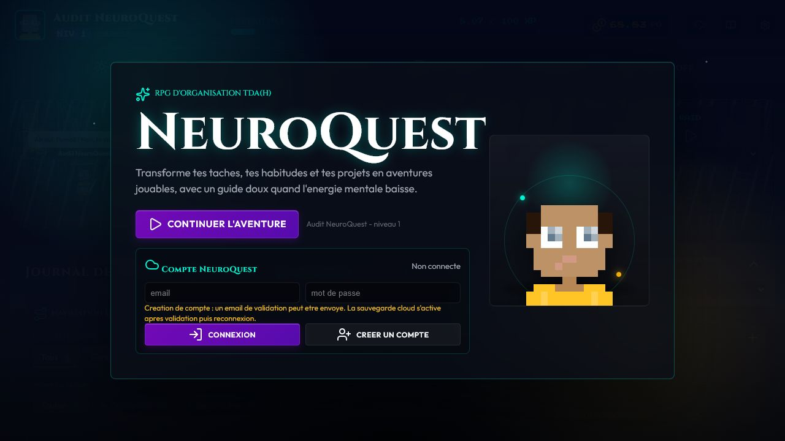
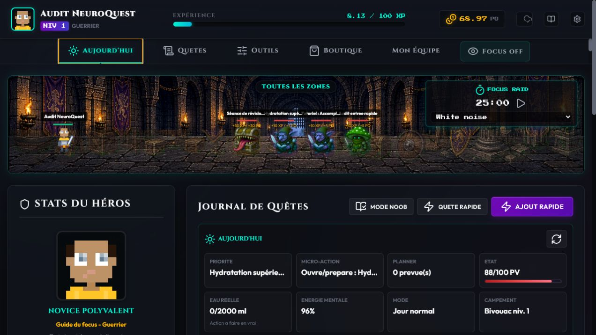
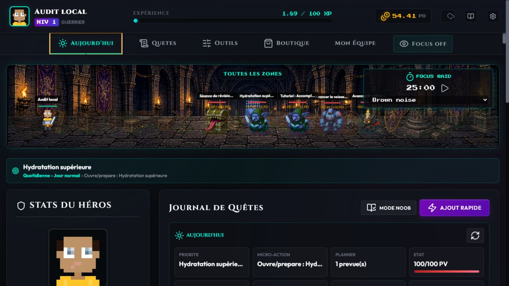
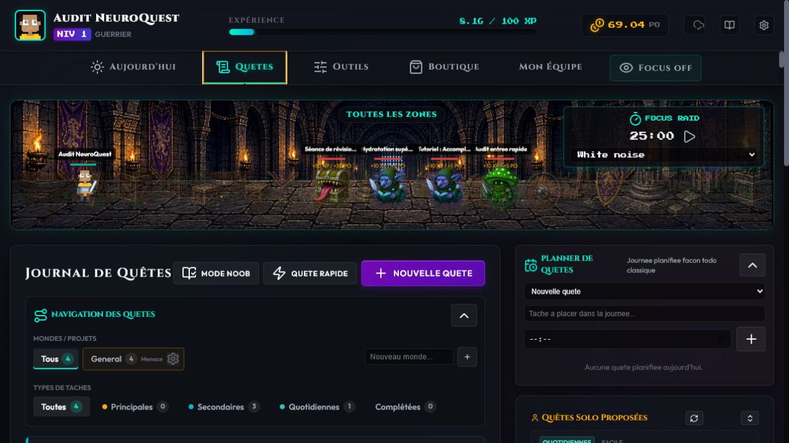
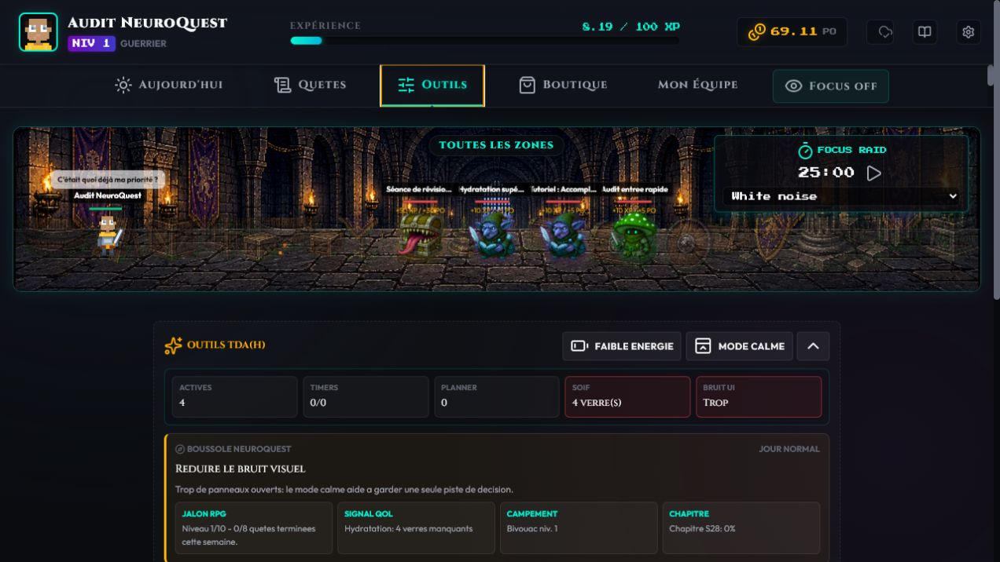
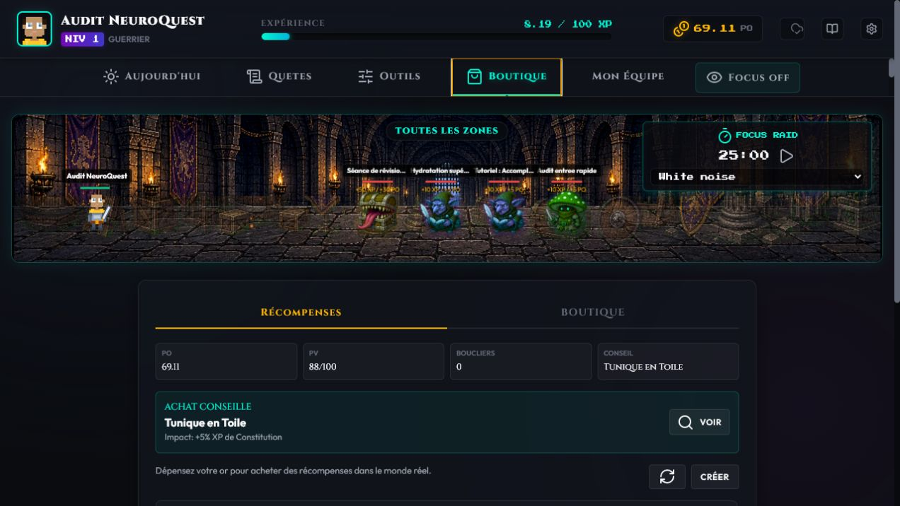
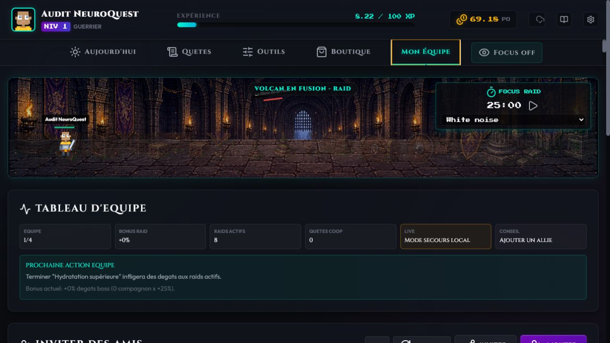
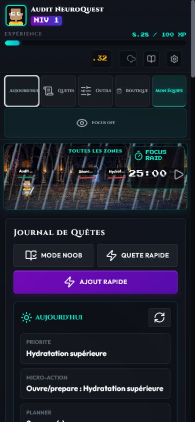
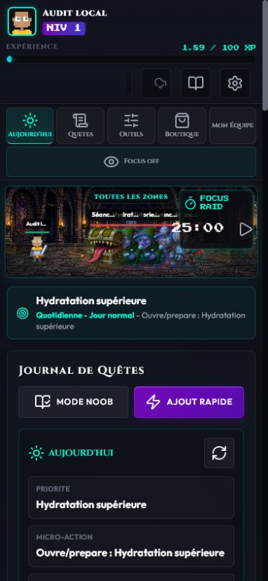

# Audit de coherence NeuroQuest - 10 juillet 2026

## Portee

Audit combine UX, accessibilite visible et coherence fonctionnelle des parcours Accueil, Aujourd'hui, Quetes, Outils, Boutique, Mon Equipe et mobile.

Objectif utilisateur : identifier rapidement la prochaine action utile, agir sans surcharge, puis recevoir une progression RPG comprehensible et meritee.

## Etapes

### 1. Accueil - Bon apres correction

- Le nom NeuroQuest et l'objectif TDA(H) sont immediatement visibles.
- Le compte est optionnel et le statut de connexion est explicite.
- Le titre du navigateur utilisait encore l'ancien nom QuestLog RPG. Il est maintenant aligne sur NeuroQuest.

### 2. Aujourd'hui - Ameliore

- La priorite, la micro-action, les PV et le planner sont regroupes.
- Deux boutons declenchaient le meme ajout rapide et plusieurs acces repetaient Focus et Faible energie.
- Une seule action Ajout rapide reste affichee. Focus est global. Faible energie reste dans Aujourd'hui.
- La prochaine action est maintenant presente dans une barre globale informative.

### 3. Quetes - Bon

- Le journal, les filtres, le planner et les propositions ont chacun une zone claire.
- Nouvelle Quete et Quete rapide ont ici deux roles differents et restent toutes les deux utiles.
- Changer d'onglet ramene maintenant en haut de la nouvelle vue.

### 4. Outils - Bon apres simplification

- La boussole, le mode calme, le demarrage doux et le mode bruit sont regroupes logiquement.
- Le second bouton Focus et le second bouton Faible energie ont ete retires.
- Sons et Musique ont ete deplaces dans Mode bruit au lieu de flotter hors ecran sur mobile.

### 5. Boutique - Bon

- Les ressources, la recommandation, les recompenses reelles et l'historique sont visibles avant l'achat.
- Les recompenses reelles annoncent leur impact et demandent une confirmation d'action.
- Aucun outil de quete ou de bruit n'est duplique dans cet onglet.

### 6. Mon Equipe - Bon, cloud non valide dans cet audit

- Resume, invitation, compagnons et raids suivent un ordre logique.
- Le mode secours local est distingue du compte live.
- La synchronisation Supabase entre deux comptes n'a pas ete rejouee pendant cet audit local.

### 7. Mobile - Bon apres correction

- Avant correction, les cinq onglets etaient difficiles a lire et certaines commandes faisaient moins de 40 px.
- Les onglets utilisent maintenant une presentation icone puis libelle, avec des cibles de 44 px ou plus.
- Le debordement horizontal est passe de 47 px a 0 px.
- La battle scene et la prochaine action restent visibles avant le contenu principal.

## Coherence de progression

- XP et PO : uniquement apres une quete, une sous-tache, un Focus Raid ou un haut fait.
- Application ouverte sans action : aucun gain passif.
- Repos au camp : recuperation de PV et preparation du bonus de repos uniquement.
- Test effectue sur un cycle de 16 secondes : XP et PO inchanges.

## Verification technique

- Syntaxe JavaScript valide.
- Aucun identifiant DOM duplique au runtime.
- Aucun avertissement ni erreur console pendant les parcours testes.
- Aucun debordement horizontal a 390 px et sur la vue ordinateur testee.
- Les anciens fichiers `css/style.css` et `js/*.js`, non charges par l'application, ont ete retires.

## Limites

Cet audit ne prouve pas une conformite WCAG complete. Les lecteurs d'ecran, le zoom a 200 %, deux comptes Supabase simultanes, les notifications systeme et la perception subjective des sons demandent des campagnes separees.
