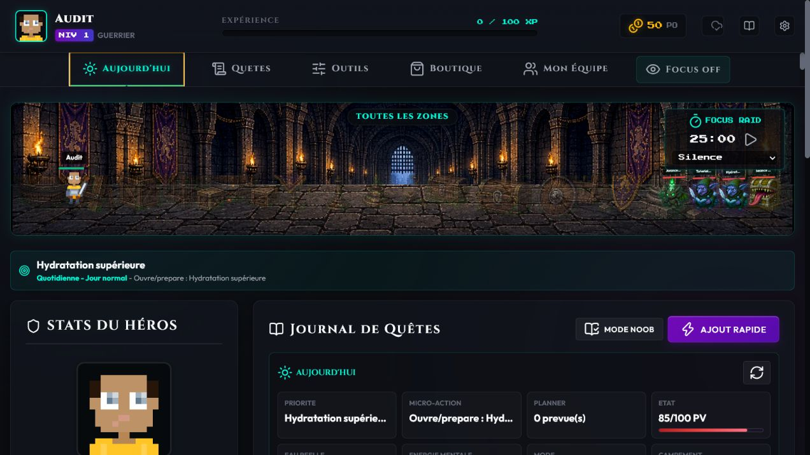
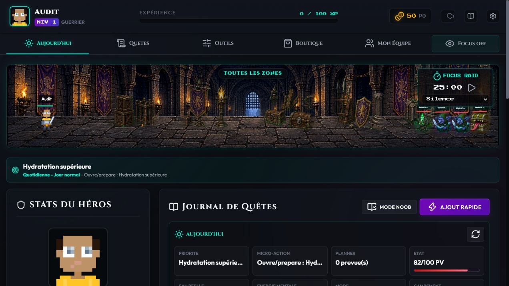
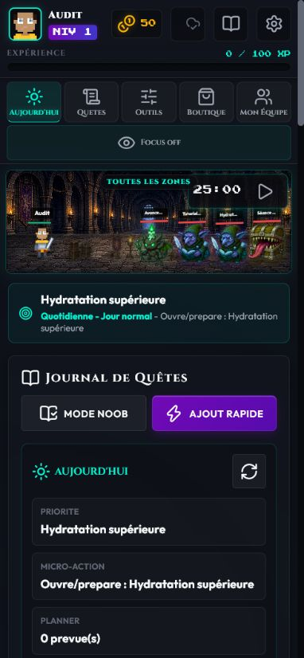
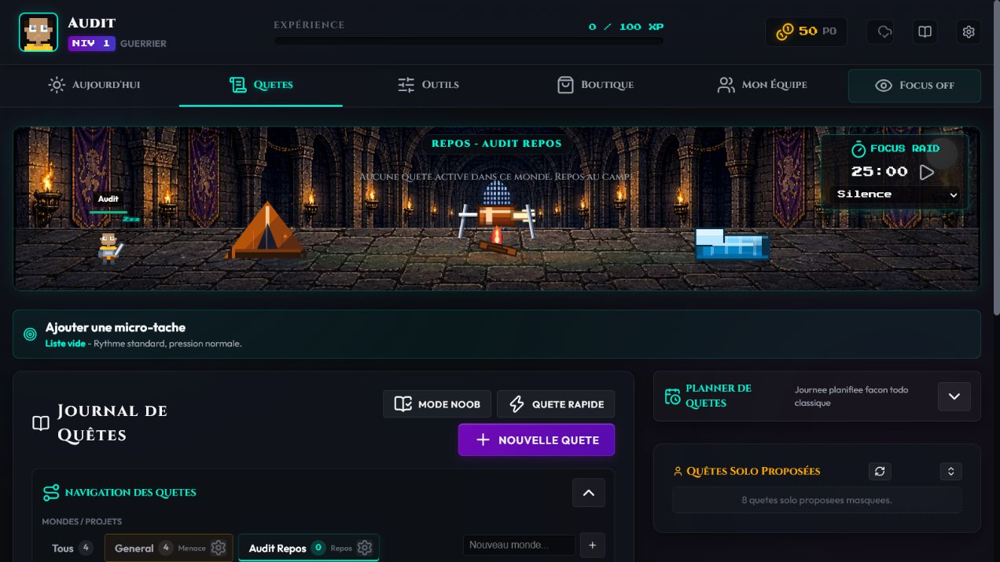

# Passe de cohérence visuelle

Date : 30 juillet 2026

## Verdict

État sain après correction. La battle scene est lisible, stable et proportionnée sur bureau et mobile. Les props premium ne sont plus répétés, fantomatiques ou placés devant les combattants.

## Parcours vérifiés

1. **Battle scene bureau — Sain.** Joueur, monstres, noms et barres de vie partagent la même ligne de sol à 1280 x 720.
2. **Props premium — Sain.** Une seule texture est rendue, découpée en groupes espacés, ancrée au sol et placée derrière les combattants.
3. **Neuf thèmes sélectionnables — Sain.** Aucun débordement horizontal; positions et dimensions restent stables après changement de thème.
4. **Film Noir — Sain.** Le changement de thème ne déplace plus la page ni les éléments fixes.
5. **Scène compacte — Sain.** À 1280 x 900 pendant le scroll, les props détaillés sont masqués et les combattants restent au sol.
6. **Mobile — Sain.** À 390 x 844, HUD, navigation, battle scene et journal occupent toute la largeur sans collision.
7. **Mode calme — Sain.** Les anciens décors simplifiés reviennent, la météo disparaît et le timer réduit reste lisible.
8. **Monde vide / repos — Sain.** Le camp garde ses propres objets; le message de repos est centré et visible sur bureau.
9. **Météo — Sain.** La pluie est moins dense et moins lumineuse; aucune météo n'est imposée à chaque scène.

## Corrections appliquées

- Props premium : opacité `0.9`, rendu unique `no-repeat`, largeur propre à chaque thème et compensation verticale de l'alpha.
- Z-order : décor `2`, combattants `22`, widget Focus `25`, titre `40`.
- Navigation : grille stable de six commandes et police cyberpunk ajustée.
- Mobile : hauteurs du HUD et des onglets remesurées après le rendu.
- Repos : message extrait de la colonne des monstres et centré sur le viewport complet.

## Captures

## Limite du contrôle

Le profil local d'audit ne contenait ni boss de raid actif ni familier équipé. Leurs règles de couche utilisent les mêmes conteneurs, mais ces deux états n'ont pas fait l'objet d'une capture active pendant cette passe.
